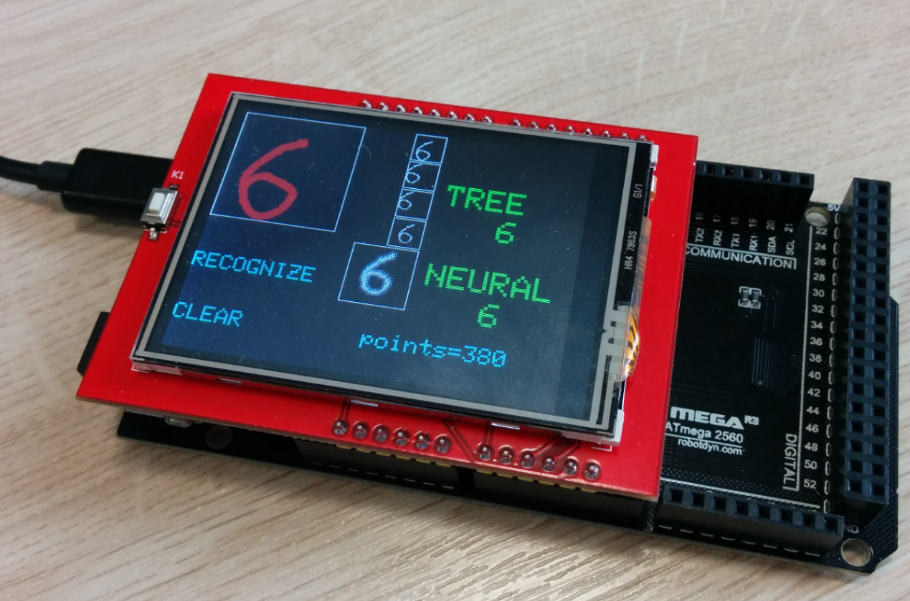
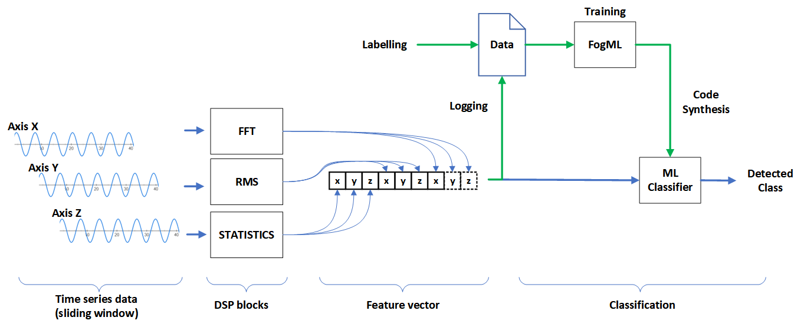

:parenttoc: True

Examples
========

Arduino Digit Recognition
-------------------------

Zephyr OS
---------

The application recognizes gestures an IoT device performs based on the built-in accelerometer. It uses the
classification algorithms and programming tools provided by FogML:

* FogML-SDK [https://github.com/tszydlo/fogml_sdk]
* FogML tools [https://github.com/tszydlo/FogML]

The application is implemented for the Zephyr-OS operating system. The tests were carried out on a ``Thingy:91``
device containing nrf9160 and manufactured by Nordic Semiconductor.

**Classification**

The accelerometer data processing pipeline is presented in the figure.

**Classification pipeline**

In the example, gestures are classified using the random forest algorithm. The generated classifier source code is in
the ``src/fogml_generated/random_forest_model.c`` file.

For the device to recognize other gestures, it is necessary to collect training data, assign labels, and train the
model. The entire process is described in Jupyter Notebook, along with training data in the tools directory. Notepad
can be run in eg Google Colab or Anaconda.

**Anomaly detection**

The example uses the modification of the K-Means algorithm and z-score to detect anomalies - deviations from training
data. Model generation for this purpose is described in Jupyter Notebook located in the tools directory.
Building

The application is implemented for the Zephyr OS operating system. Since the application is for ``Thingy:91`` device,
we use NRF Connect SDK 2.0.0 and VSCode plugin, which simplifies the process of building, flashing and debugging
applications for Zephyr. The application can also be built directly using the west tool and the base Zephyr.

The application uses the basic drivers available in the operating system, and porting to another device should be
relatively easy.

Arduino
-------

Complex examples
----------------
