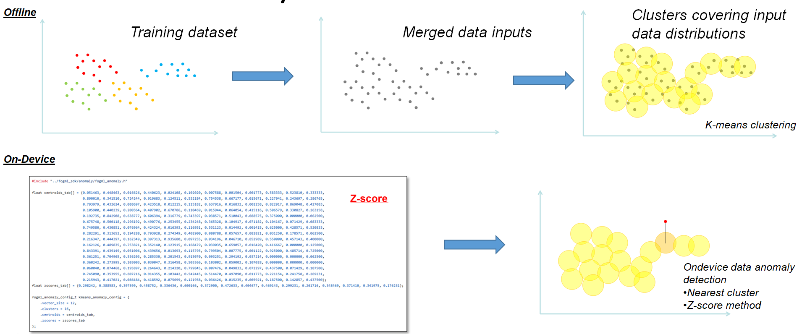
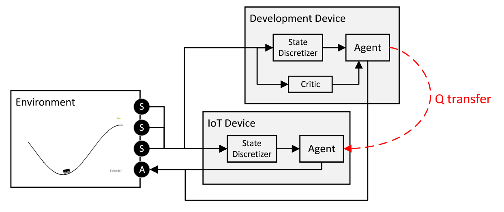

:parenttoc: True

Code Generators
===============

Classification
--------------

FogML allows generation of the C source code for simple classifiers trained in the ``scikit-learn library``. The library supports:

- DecisionTreeClassifier
- GaussianNB
- MLPClassifier
- RandomForestClassifier

The example generates a classifier code for one of the selected methods:

.. code-block:: python

    from sklearn import datasets, tree
    from fogml.generators import GeneratorFactory

    iris = datasets.load_iris()
    X = iris.data
    y = iris.target

    #clf = tree.DecisionTreeClassifier(random_state=3456)
    #clf = naive_bayes.GaussianNB()
    clf = MLPClassifier(hidden_layer_sizes=(4,), random_state=34, solver='adam', max_iter=1500)
    #clf = RandomForestClassifier(n_estimators=10)

    clf.fit(X, y)
    print( 'accuracy: ',clf.score(X,y))

    factory = GeneratorFactory()
    generator = factory.get_generator(clf)
    generator.generate()

The main classifier code will be generated in the current folder. Examples of generated files are located in the ``fogML/examples/simple/models directory``.

Anomaly detection
-----------------

The example uses the modification of the *K-Means* algorithm and *z-score* to detect anomalies - deviations from training data. Model generation for this purpose is described in Jupyter Notebook located in the tools directory.

.. code-block:: python

  from sklearn.preprocessing import MinMaxScaler
  from fogml.anomaly import KMeansAnomalyDetector
  from fogml.generators import GeneratorFactory

  scaler = MinMaxScaler()
  transformer = scaler.fit(spX)
  data_norm = transformer.transform(spX)

  anomalyDetector = KMeansAnomalyDetector(n_clusters=16)
  anomalyDetector.fit(data_norm)

  factory = GeneratorFactory()
  generator = factory.get_generator(transformer)
  generator.generate(fname="min_max_scaler_model.c")

  generator = factory.get_generator(anomalyDetector)
  generator.generate(fname="kmeans_anomaly_model.c")

Copy generated ``kmeans_anomaly_model.c`` and ``min_max_scaler_model.c`` to the folder ``fogml_generated`` in the MCU project.

Time-series data processing
---------------------------

Processing time series from sensors using FogML requires their pre-processing directly on the device. More information
in the SDK and Examples section.

Reinforcement learning
----------------------

