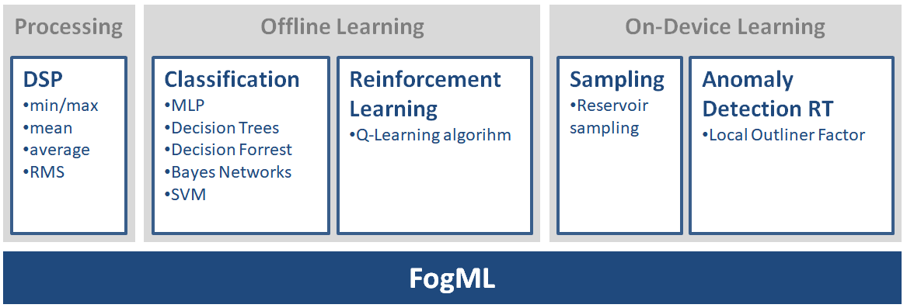

Welcome to FogML's documentation!
===================================

Due to the development of IoT solutions, we can observe the constantly growing number of these devices in almost every aspect of our lives. The machine learning may improve increase their intelligence and smartness. Unfortunately, the highly regarded programming libraries consume to much resources to be ported to the embedded processors.

The FogML is a set of tools enabling TinyML on microcontrollers as low resource-limited as ARM M0 cores. In contrast to many other frameworks, the FogML utilises classic machine learning methods such as density-based anomaly detection and classifiers based on Bayesian networks, decision forests and vanilla MLP. In addition, it supports off-device learning for the classification problem and on-device learning for anomaly detection. The active learning anomaly detection is based on reservoir sampling and outlier detection algorithms which are trained directly on the device. The dedicated library performs the time series processing on the devices, computing the feature vector consisting of RMS, FFT, amplitude and other low-level signal metrics. One of the techniques used in FogML is source code generation of the inferencing functions for embedded devices. It leads to a much smaller memory footprint than for more computationally advanced solutions such as deep neural networks.

The structure of the project is as follows:

* the `src` folder contains the source code generators for machine learning models i.e.: naive bayes, decision trees/forrest and neural nets;
* the `example` folder contains the simple examples and the MNIST digit recognition for Arduino board and the simple TFT touchscreen.

Examples of anomaly detection and classification algorithms provided by the FogML project for embedded devices:

* `FogML-SDK` [https://github.com/tszydlo/fogml_sdk]
* `FogML Arduino` [https://github.com/tszydlo/FogML-Arduino]
* `FogML Zephyr OS` [https://github.com/tszydlo/FogML-Zephyr]

Example of connectivity and device management provided by LwM2M protocol:

* `FogML-Zephyr-LwM2M` [https://github.com/tszydlo/FogML-Zephyr-LwM2M]

TinyML lifecycle Management with FOTA using LwM2M protocol:

* `FogML-Zephyr-FOTA` [https://github.com/tszydlo/FogML-Zephyr-FOTA]

Papers
------

* *Tomasz Szydlo, Marcin Nagy*, Device management and network connectivity as missing elements in TinyML landscape, *TinyML Research Summit 2023*

* *Tomasz Szydlo*, Online Anomaly Detection Based On Reservoir Sampling and LOF for IoT devices, *CoRR abs/2206.14265 (2022)*

* *Tomasz Szydlo, Prem Prakash Jayaraman, Yinhao Li, Graham Morgan, Rajiv Ranjan, TinyRL*, Towards Reinforcement Learning on Tiny Embedded Devices. *CIKM 2022, 4985-4988*

* *Tomasz Szydlo, Joanna Sendorek, Robert Brzoza-Woch*, Enabling machine learning on resource constrained devices by source code generation of the learned models, *ICCS 2018: 682-694*

.. note::

   This project is under active development.

.. toctree::
   :maxdepth: 3
   :hidden:
   :caption: Contents:

   Home <self>
   usage
   generators
   sdk
   pipelines
   examples
