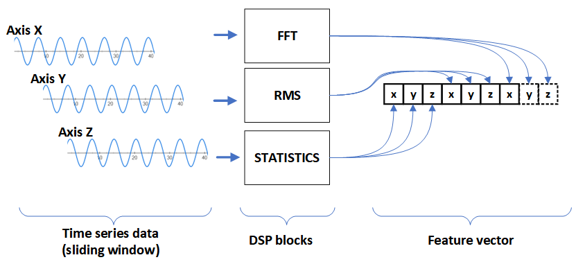

SDK for devices
===============

SDK implements FogML [https://github.com/tszydlo/FogML] machine learning algorithms for resource-constrained devices.

Available modules and algorithms:

* anomaly_rt
   * reservoir sampling, Local Outliner Factor
* classifier
   * header file for the source code generated with FogML
* dsp
   * digital signal processing algorithms for initial time series analysis
* ports
   * code needed to port the SDK to various frameworks - supports Arduino and Zephyr OS
* rl
   * header files for the reinforcement learning source code generated with FogML

DSP Processing logic
--------------------

DSP Processing blocks
---------------------

.. code-block:: cpp

  #define TINYML_DSP_FFT  1 //FFT 1 peak
  #define TINYML_DSP_BASE  2 // (max-min), mean
  #define TINYML_DSP_VARIANCE  3 //variance
  #define TINYML_DSP_ENERGY  4 //energy
  #define TINYML_DSP_CROSSINGS  5 //crossing through mean
  #define TINYML_DSP_MINMAX  6 //min, max

Each block generates the predefined number of features for each axis:

.. code-block:: cpp

  #define TINYML_DSP_FFT_LEN  2 // amp, freq
  #define TINYML_DSP_BASE_LEN  2 // (max-min), mean
  #define TINYML_DSP_VARIANCE_LEN  1 //variance
  #define TINYML_DSP_ENERGY_LEN  1 //energy
  #define TINYML_DSP_CROSSINGS_LEN  1 //crossing through mean
  #define TINYML_DSP_MINMAX_LEN  2 //min, max

DSP Block configuration
-----------------------
.. code-block:: cpp

  //BLOCK 1 - BASE
  tinyml_block_base_config_t block1_config;
  tinyml_dsp_block_t block1 = {
      .type = TINYML_DSP_BASE,
      .config = &block1_config
  };

  //BLOCK 2 - ENERGY
  tinyml_block_energy_config_t block2_config;
  tinyml_dsp_block_t block2 = {
      .type = TINYML_DSP_ENERGY,
      .config = &block2_config
  };

  //BLOCK 3 - CROSSINGS
  tinyml_block_crossings_config_t block3_config = {
      .threshold = 0.01
  };
  tinyml_dsp_block_t block3 = {
      .type = TINYML_DSP_CROSSINGS,
      .config = &block3_config
  };

DSP configuration
-----------------

.. code-block:: cpp

  // DATA ACQUISITION
  // accelerometer data X, Y, Z
  #define ACC_TIME_TICKS  64
  #define ACC_AXIS  3

  // number of features - depends on the DSP blocks
  #define FOGML_VECTOR_SIZE ((TINYML_DSP_BASE_LEN + TINYML_DSP_ENERGY_LEN + TINYML_DSP_CROSSINGS_LEN) * ACC_AXIS)

  //DSP config
  tinyml_dsp_block_t *blocks_tab[] = {&block1, &block2, &block3};

  tinyml_dsp_config_t my_dsp_config = {
      .time_ticks = ACC_TIME_TICKS,
      .axis_n = 3,
      .blocks_num = 3,
      .blocks = blocks_tab
  };

SDK usage
---------
.. code-block:: cpp
  :emphasize-lines: 3,6

  void fogml_classification(float *time_series_data) {
      float *vector = (float*)malloc(sizeof(float) * FOGML_VECTOR_SIZE);
      tinyml_dsp(time_series_data, vector, &my_dsp_config);
      int cl;

      cl = classifier(vector);

  #ifdef FOGML_VERBOSE
      fogml_printf("Detected  class = ");
      fogml_printf_int(cl);
      fogml_printf("\n");
  #endif

      free(vector);
  }

